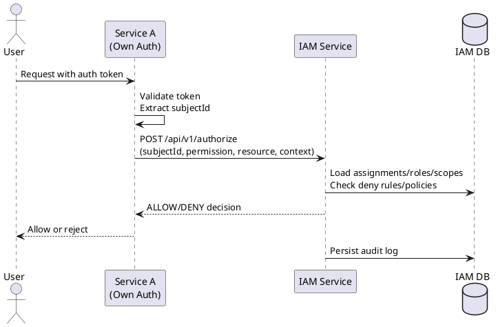

# IAM Service Integration Guide (Single Source of Truth)

This document explains how to integrate this IAM authorization service with any other service that already has its own authentication system. It is written for a production setup where **authentication happens in the calling services** and **authorization happens in IAM**.

---

## 1) Roles of Each System

### Your application services (already have auth)
- Authenticate users with their own auth system (JWT/session/OAuth/SSO).
- Extract a stable `subjectId` (user UUID or service account ID).
- Call IAM to check permissions.
- Enforce IAM’s ALLOW/DENY decision locally.

### IAM service (this project)
- Stores permissions, roles, scopes, assignments, deny rules, policies.
- Evaluates authorization with those rules.
- Logs audit trail for each decision.

**Key principle:** IAM does **not** manage user accounts. It only knows **subjectIds** and their **assignments**.

---

## 2) Identity and Subject IDs

### What is `subjectId`?
A stable identifier used across your system (e.g., user UUID from your auth DB). IAM uses this as the lookup key for assignments.

### Does IAM need all users stored?
No. IAM only stores assignments. Users without assignments never appear in IAM.

### Business membership vs authorization roles
Services may store **business membership roles** (e.g., staff type, org membership, invitation state). IAM stores **authorization roles/permissions**. A provisioning worker maps business roles → IAM roles/assignments.

---

## 3) Provisioning / Syncing Assignments

IAM does **not** auto-discover users. You must push assignments into IAM when users are created or their roles change.

### Recommended pattern: Event-driven sync
1. User service emits events:
   - `UserCreated`
   - `UserRoleChanged`
   - `UserDeactivated`
2. An “IAM sync” worker maps local roles → IAM roles.
3. Worker calls IAM Admin APIs to create or revoke assignments.

### Alternative: Direct provisioning from user service
When a user is created/updated, the user service directly calls IAM:
- `POST /api/v1/assignments`
- `DELETE /api/v1/assignments/{id}` for revoke

### IMPORTANT: ScopeId must be deterministic
IAM assignments require a `scopeId`. Production systems solve this by **creating IAM scopes when orgs are created**, and storing the mapping:

```
org.id -> iam_scope_id
```

Event payloads should include `iamScopeId` directly:
```json
{
  "eventType": "UserCreated",
  "userId": "user-123",
  "iamScopeId": "2efb5de7-...",
  "role": "TRAVEL_AGENT"
}
```

If you don’t store `iamScopeId`, the worker must resolve it by a stable **scope code** (e.g., `orgCode -> scopes.code`). In that case, org codes must be globally unique.

---

## 4) Role Mapping Strategy

If your services already have local roles, you need a **mapping layer**:

Example:
- Local role `TRAVEL_AGENT` → IAM role `ReservationAgent`
- Local role `ORG_ADMIN` → IAM role `OrgAdmin`

Mapping can live in:
- A dedicated mapping service
- A config table in the user system
- A policy document that drives assignment provisioning

**IAM should remain the final source of truth for permissions.**

---

## 5) Authorization Call Flow

### Step-by-step
1. Service authenticates the user with its own auth system.
2. Service extracts `subjectId`.
3. Service calls IAM:

```
POST /api/v1/authorize
X-Internal-Api-Key: <internal-key>   (or Bearer token with IAM_CLIENT)
```

Body:
```json
{
  "subject": "user-123",
  "permission": "booking.reservation.read",
  "resource": {
    "type": "reservation",
    "id": "res-999",
    "scopeId": "<scope-uuid>",
    "metadata": {"ownerId": "user-123"}
  },
  "context": {
    "ipAddress": "10.1.2.3",
    "requestId": "req-123",
    "additionalContext": {"mfa": true}
  }
}
```

4. IAM evaluates:
   - Deny rules
   - Assignments + role permissions
   - Scope containment
   - Optional policies (ABAC/ReBAC)
5. IAM returns ALLOW/DENY.
6. Service enforces decision locally.

---

## 6) Scopes and Multi‑Tenancy

Scopes are how IAM understands **organizations, tenants, and hierarchy**.

Hierarchy enforced by DB trigger:
```
GLOBAL (0)
REGION (1)
COUNTRY (2)
ORG (3)
DEPT (4)
TEAM (5)
PROJECT (6)
```

Assignments are scoped:
- A user assigned at `ORG` can act on resources inside that ORG and its descendants.
- IAM checks scope containment before granting permission.

---

## 7) Permissions and Roles

### Permissions
Structured as `domain.resource.action`, e.g.:
- `booking.reservation.read`
- `booking.reservation.approve`

### Roles
Roles bundle permissions. Assignments attach roles to subjects at scopes.

---

## 8) Deny Rules and Policies

### Deny Rules
Override everything. Use for emergency suspensions.

### Policies (ABAC)
Optional rules evaluated after roles:
- Example: allow only if `subject == resource.ownerId`

---

## 9) Authentication Between Services and IAM

### Internal API key (recommended for service-to-service)
- Use header `X-Internal-Api-Key`
- Grants `ROLE_INTERNAL`
- Only valid for `/authorize` endpoints

**Production hardening (recommended):**
- Per‑service API keys (not a shared key)
- Rotation strategy (short‑lived / quarterly rotation)
- Rate limiting
- Network allowlist or mTLS
- Include `X-Service-Id` header and validate it
- Store service ID in audit logs (caller attribution)

### JWT for admin APIs
- Use `Authorization: Bearer <token>`
- Must contain role `IAM_ADMIN`

---

## 10) Error Handling Expectations

- `401 Unauthorized`: missing/invalid auth to IAM
- `403 Forbidden`: authenticated but insufficient role
- `400 Bad Request`: validation or constraint error
- `404 Not Found`: invalid route (only after auth)

---

## 11) Audit and Compliance

Every authorization decision is recorded in `authorization_audit`.
You can query it via:
- `/api/v1/audit/subject/{subjectId}`
- `/api/v1/audit/resource/{type}/{id}`

---

## 12) Baseline Access Strategy

If users with no assignment should still access basic features, choose one:
- Create a default `BaseUser` assignment at GLOBAL on user creation
- Or mark certain endpoints as public (no IAM check)

---

## 13) Provisioning Example (User Onboarding)

**When a user is created in user service:**
1. Determine desired local role.
2. Map to IAM role.
3. Call IAM:

```json
POST /api/v1/assignments
{
  "subjectId": "user-123",
  "subjectType": "USER",
  "roleId": "<iam-role-uuid>",
  "scopeId": "<org-scope-uuid>",
  "grantedBy": "user-service"
}
```

---

## 14) Capabilities / Bootstrap Endpoint (Implemented)

To avoid each service inventing its own “what can this user do” logic, IAM exposes:

**POST** `/api/v1/effective-permissions`

**Request**
```json
{
  "subject": "user-123",
  "scopeId": "2efb5de7-9b9b-4746-a7b0-3bda1cc1c6b1",
  "resource": { "type": "reservation" },
  "context": { "additionalContext": { "mfa": true } },
  "includeDenied": true
}
```

**Response**
```json
{
  "subject": "user-123",
  "scopeId": "2efb5de7-9b9b-4746-a7b0-3bda1cc1c6b1",
  "permissions": ["booking.reservation.read"],
  "deniedPermissions": ["booking.reservation.cancel"]
}
```

**Notes**
- This endpoint uses the same deny + assignment-condition + policy evaluation as `/authorize`.
- If you omit `resource` or `context`, any condition that depends on them may exclude permissions.

---

## 15) Minimal Integration Checklist

- [ ] Use stable `subjectId` across all systems
- [ ] Map local membership roles → IAM roles
- [ ] Provision assignments into IAM (with **scopeId**)
- [ ] Create IAM scopes alongside org creation
- [ ] Call `/authorize` for permission checks
- [ ] Enforce IAM decision in service
- [ ] Monitor audit logs

---

## 16) FAQ

**Q: Do services keep their own role tables?**
A: Services can store business membership roles. IAM stores authorization roles/permissions.

**Q: What if a user has no assignment?**
A: IAM returns DENY for all permissions.

**Q: Can we assign temporary access?**
A: Yes. Use `expiresAt` in assignments.

---

If you want, I can add a detailed sequence diagram (PlantUML) and a sample “IAM sync worker” implementation.

---

## 17) Sequence Diagram (PlantUML)

Use this diagram to visualize the integration flow. You can render it with any PlantUML tool.



---

## 18) IAM Sync Worker (Example)

This is a simple example of how a user system can keep IAM assignments in sync.

### 16.1 Inputs (events)

**UserCreated**
```json
{
  "eventType": "UserCreated",
  "userId": "user-123",
  "orgId": "org-789",
  "role": "TRAVEL_AGENT"
}
```

**UserRoleChanged**
```json
{
  "eventType": "UserRoleChanged",
  "userId": "user-123",
  "orgId": "org-789",
  "role": "ORG_ADMIN"
}
```

**UserDeactivated**
```json
{
  "eventType": "UserDeactivated",
  "userId": "user-123"
}
```

### 16.2 Mapping table (local → IAM)

```
TRAVEL_AGENT -> ReservationAgent
ORG_ADMIN    -> OrgAdmin
FINANCE      -> FinanceManager
```

### 16.3 Worker logic (high level)

1) Read event from queue\n
2) Map local role → IAM role name\n
3) Resolve IAM roleId + scopeId\n
4) Create or revoke assignment\n

### 16.4 Example calls to IAM

**Create assignment**
```json
POST /api/v1/assignments
{
  "subjectId": "user-123",
  "subjectType": "USER",
  "roleId": "<iam-role-uuid>",
  "scopeId": "<org-scope-uuid>",
  "grantedBy": "user-service"
}
```

**Revoke assignment**
```json
DELETE /api/v1/assignments/<assignment-id>?revokedBy=user-service&reason=deactivated
```

### 16.5 Required IAM lookups

You can cache these lookups in the worker:

- Role by name: `/api/v1/roles?orgType=...` or `/api/v1/roles/{id}`
- Scope by code or hierarchy: `/api/v1/scopes?type=...`

---
